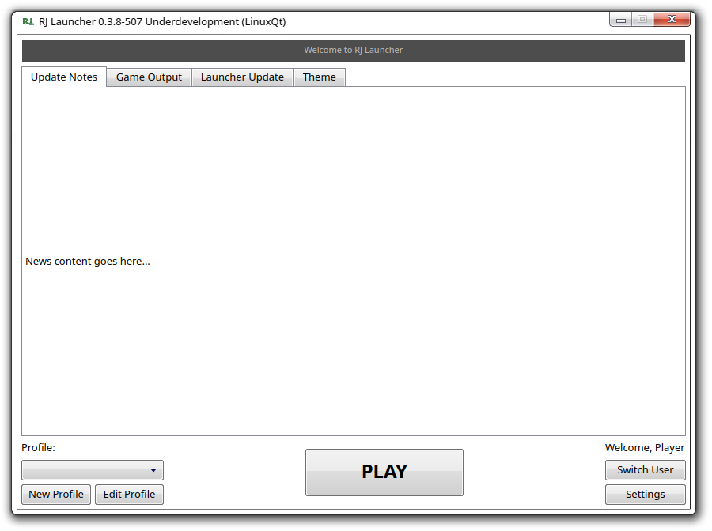
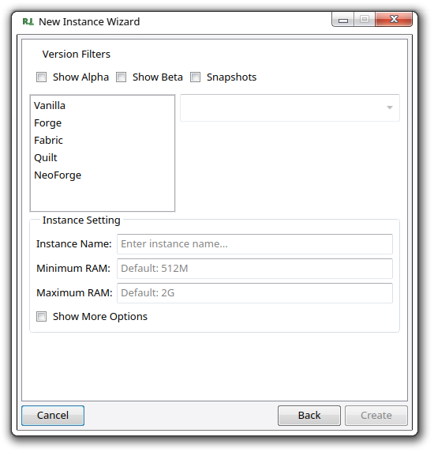

## [RJ Launcher For Minecraft](https://github.com/xrejenx/RJ-MinecraftLauncher/releases)
### Lightweight launcher with gui design base on legacy launcher of Mojang Minecraft Launcher.

|  |  |
|--------------------------------------------|---------------------------------------------------------------|
| Main Menu u31 0.3.8-507                    | Instance Create Menu u31 0.3.8-507                            |

**Notes : Picture capture in linux-cachyOS**

**This launcher is an unofficial launcher.**
_It is not affiliated with, endorsed by, or supported by Mojang, Microsoft, or any other official Minecraft launcher developers.  
Use at your own discretion._

**Third‑Party Tools**

This project bundles **[7‑Zip](ca://s?q=7zip_license_terms)** for archive extraction.  
7‑Zip is licensed under the GNU LGPL. See the included [license](https://github.com/xrejenx/RJ-MinecraftLauncher/blob/RJL/readme/7zipLicense/License.txt) file for details.  
7‑Zip is developed by Igor Pavlov and is **not related to Me**.
i
